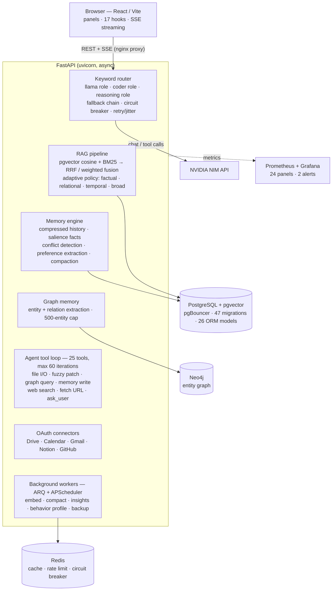

# Eidetic

[](https://github.com/ymr-gif/eidetic/actions/workflows/ci.yml)
[](https://github.com/ymr-gif/eidetic/releases)


**Eidetic** is a self-hosted, multi-user AI memory platform backed by NVIDIA NIM inference. Multi-model routing, hybrid RAG, persistent graph memory, an AI agent tool loop, and five OAuth connectors (Drive, Calendar, Gmail, Notion, GitHub — UI-gated pending public deploy) — all in a single Docker Compose stack.

**Backend:** Python / FastAPI · **Frontend:** React / Vite · **Infra:** PostgreSQL + pgvector, Redis, Neo4j, Prometheus, Grafana

> **Deployment direction:** NVIDIA NIM is a test backend. The app targets a self-hosted home
> server (llama.cpp/GGUF; Mixtral → eventual MoE) via one OpenAI-compatible endpoint — porting is
> a config repoint, not a rewrite.


*Keyword-routed streaming reply (fast llama role → reasoning role), then the agent tool loop reading an attached file — with per-reply model, token/cost meter, and retrieval-grounding badges.*

## Try it live

**[https://eidetic.work](https://eidetic.work)** — log in with:

```
username:  demo
password:  eidetic-demo
```

A read-and-chat sandbox. Registration is invite-only. Every login spins up its own **private, auto-expiring sandbox** — your chats, files, and memory are isolated to your session and wiped after a couple of hours idle, so don't rely on anything you save there persisting. Spend is capped ($1 per session, pooled ceiling across all demo sessions).

Eidetic runs on a home server, so it is not a 24/7 service. If the box is down you will get a status page telling you when it was last seen, rather than a dead link.

---

## Architecture



---

## Features

### Inference & Routing
- **Keyword classifier** automatically picks the right model for the task; supports per-request override and per-conversation model lock
- **Live model catalog** (admin-curated): scheduled scanner probes available NVIDIA NIM models; admins enable/disable, set per-model pricing and request extras; users can search and pick models by name, lock conversations to them, or compare 2–4 models side-by-side
- **Fallback chain**: `chosen model → reasoning → coder → llama` — never drops a request if a model is available
- **Circuit breaker**: 5 consecutive failures trip the circuit; 90s cooldown; Redis-persisted across restarts; pre-tripped at startup if a model probe fails
- **Retry with jitter**: up to 4 attempts with exponential + jitter backoff (~1s / 2s / 4s / 8s)
- **Rate limiting**: sliding-window per user (15 req/60s) + per model (llama=15, coder=10, reasoning=5); Redis-backed; fail-open when Redis is down

### Retrieval-Augmented Generation
- **Hybrid retrieval**: pgvector cosine similarity + PostgreSQL BM25 full-text, parallelised, fused via Reciprocal Rank Fusion (k=60) or weighted fusion with configurable α
- **Adaptive query policy**: classifies each query as `factual` / `relational` / `temporal` / `broad` and selects the fusion strategy and k accordingly
- **File knowledge base**: upload PDF, DOCX, XLSX, plain text/code/markdown; streaming SHA-256 dedup; 1600-char chunks, 200-char overlap, sentence-aligned tail
- **Context budget allocator**: drops lowest-priority memory tiers when the prompt would exceed `context_window − max_output_tokens − 10%`; re-applied on every tool iteration

### Memory System
Memory is layered — injected in priority order on every turn:

```
system prompt → graph context → graph facts → user state → active goals
→ project summary → relevant chunks → earlier history → last session
→ conversation history → file context → user message
```

- **Compressed history**: summarised when conversation exceeds 4 000 tokens or 15 messages
- **Project summary**: maintained separately; updated alongside history compression
- **Salience scoring**: per-fact `0.95^(hours/24)` time decay before top-20 selection; bumped on every access; facts below 0.05 pruned
- **Memory compaction**: LLM-driven dedup and merge; snapshots to `UserMemoryVersion`; scheduled daily at 03:00 UTC via APScheduler
- **Conflict resolution**: contradicting facts detected and stored as `MemoryConflict`; user resolves via keep A / keep B / merge / discard; auto-resolved `keep_a` after 7 days
- **Preference extraction**: runs every 50 assistant messages; no LLM inference cost per turn
- **Behavior profile**: lightweight per-reply counters (query types, topics, tools, models used); feeds proactive insight generation

### Graph Memory (Neo4j)
- Entity and relationship extraction by the reasoning model after each reply
- Per-user knowledge graph with a 500-entity cap; LRU eviction by `updated_at`
- Graph query results Redis-cached (TTL 60s); cache busted on every write
- Fulltext index `entity_name_ft` + range index `entity_user_id` created on startup
- Batch UNWIND writes (2 round-trips regardless of entity/relation count)

### AI Agent Tool Loop
Tools are offered on **capability alone** (connector active, env flag on, files attached, URL present) and the model decides when to call them via native function calling. Attaching file IDs forces the reasoning model.

| Tool | Description |
|---|---|
| `list_files` | list knowledge base files |
| `read_file` | read up to 100k chars (capped to 12k in context) |
| `write_file` / `create_file` / `append_to_file` | file mutations |
| `patch_file` | fuzzy find-and-replace (exact → CRLF-norm → stripped-edges) |
| `search_in_file` / `search_across_files` | search without full reads |
| `ask_user` | pause the loop and ask the user a question; resumes on reply |
| `query_graph` | Cypher query against the user's Neo4j graph |
| `write_memory` | propose a memory write; requires user confirmation |
| `web_search` | search the web for live information; offered whenever `WEB_SEARCH_ENABLED=true` (capability gate only — the model decides when to call it); backends: SearXNG (self-hosted) or Tavily |
| `fetch_url` | fetch and read the full text of any web page mid-conversation; injected when the user's message contains a URL; ephemeral — content is returned as tool-result context, nothing stored; SSRF-hardened: scheme allowlist, DNS-pinned connection (TOCTOU-safe), port allowlist `{80, 443}`, 1 MB byte cap, Content-Type allowlist |
| `drive_list_files` / `drive_read_file` / `drive_search` | read-only Google Drive access; offered when the connector is active **and** the session has latched on Drive intent (embedding-cosine intent latch — schemas are withheld until then, so a greeting can't fire them) |
| `calendar_list_events` / `calendar_get_event` / `calendar_search_events` | read Google Calendar; active **and** calendar-intent-latched, same latch |
| `calendar_create_event` / `calendar_update_event` / `calendar_delete_event` | calendar **writes** — never hit Google from the loop; return a confirm sentinel → `confirm_calendar_write` SSE → UI confirm card → `POST /api/integrations/calendar/execute` |
| `gmail_list_messages` / `gmail_get_message` / `gmail_search_messages` | read-only Gmail access; active **and** email-intent-latched, same latch |

**25 tools total** — 9 file/graph, `ask_user`, `write_memory`, `web_search`, `fetch_url`, 3 Drive, 6 Calendar, 3 Gmail. Connector tools are injected per-user whenever that connector has an active connection. `fetch_url` is the exception — injected only when the user's message contains a URL.

Capability-available schemas are passed name-sorted for a byte-stable prompt prefix (so the KV prefix cache makes repeat cost near-zero). A `select_tool_schemas()` prefilter switch (`registry.py`) decides the final subset; below `TOOL_PREFILTER_THRESHOLD` (32) it is passthrough — all tools. An embedding prefilter path (embed the query, cosine-match against cached tool-description vectors, pass top-k) is reserved for future tool growth; at the current 25 tools every schema is passed through.

### OAuth Connectors
Five OAuth connectors implemented end-to-end — OAuth flow, token refresh, per-user tool injection. UI connect buttons are gated pending public deploy (`ENABLED_CONNECTOR_TYPES` in `frontend/src/hooks/useIntegrations.js`); connected sources stay active and their tools keep working regardless of the gate. Credentials are Fernet-encrypted at rest (`INTEGRATION_SECRET`); refresh-on-expiry; a 401 marks the source `needs_reauth`.

| Connector | Backend | Scope | Tools | UI Status |
|---|---|---|---|---|
| Google Drive | read-only | `drive.readonly` | `drive_list_files`, `drive_search`, `drive_read_file` | UI-gated |
| Google Calendar | read-write | `calendar.events` | list / get / search / create / update / delete | UI-gated |
| Gmail | read-only | `gmail.readonly` | `gmail_list_messages`, `gmail_get_message`, `gmail_search_messages` | UI-gated |
| Notion | read | per-provider | (sync pending) | UI-gated |
| GitHub | read | per-provider | (sync pending) | UI-gated |

- Drive + Calendar + Gmail share **one** Google OAuth app (`GOOGLE_CLIENT_ID/SECRET`); shared base: `GoogleOAuthConnector`.
- OAuth flow is implemented (`GET /integrations/oauth/start` → consent → callback); the UI exposes it only for connector types listed in `ENABLED_CONNECTOR_TYPES`.
- Calendar **writes never hit Google from the tool loop** — confirm sentinel flow verified live (create → confirm → execute → delete) for already-connected sources.
- A scheduler job re-syncs all active sources every 6h.

### Image OCR & Voice Input
- **Image OCR** (`IMAGE_OCR_ENABLED`, default off): CPU PaddleOCR extracts text from uploaded/pasted images and scanned PDFs (pypdfium2 render fallback, ≤20 pages); text is embedded and injected as context — no vision model required.
- **Voice input** (`VOICE_ENABLED`, default off): `POST /api/transcribe` accepts an audio upload, transcribes via the pluggable `ASR_BACKEND`, and injects the text as a chat message.

### Notifications
- Per-user preferences (`GET/PATCH /api/notifications/preferences`) gate email + web-push delivery per channel.
- Web push via VAPID: `GET /api/notifications/vapid-public-key`, `POST /api/notifications/push/subscribe` — verified end-to-end through real FCM (2026-07-03).
- Email delivery is fail-closed STARTTLS by default (`SMTP_STARTTLS=true`); a MailHog dev relay (`docker compose --profile mail up -d mailhog`, UI on `127.0.0.1:8025`) verifies delivery locally with `SMTP_STARTTLS=false`.

### Daily/Weekly Digest
An APScheduler cron job generates a per-user markdown summary of the past 7 days — new files uploaded, memory snapshots taken, insights generated, and goals updated. Delivered as a `UserInsight` (visible in the Insights panel) and optionally emailed via SMTP.

| Variable | Default | Description |
|---|---|---|
| `DIGEST_ENABLED` | `false` | Enable the digest job |
| `DIGEST_SCHEDULE` | `0 8 * * 1` | Cron schedule (default: Monday 8 AM UTC) |
| `SMTP_HOST` | — | SMTP server hostname; leave blank to skip email |
| `SMTP_PORT` | `587` | SMTP port (`465` = implicit TLS, no STARTTLS) |
| `SMTP_STARTTLS` | `true` | Require STARTTLS (fail-closed); set `false` only for plain dev relays (MailHog) |
| `SMTP_USERNAME` | — | SMTP login username |
| `SMTP_PASSWORD` | — | SMTP login password |
| `SMTP_FROM` | — | Sender address (falls back to `SMTP_USERNAME`) |

Users set their email address via `PATCH /auth/me/email`. If unset, digest is delivered as `UserInsight` only.

---

### Event-Driven Webhook Triggers
External systems can POST events to the platform via a per-user token:

```
POST /api/webhooks/{user_token}   { "event_type": "reminder", "payload": {...} }
```

Supported event types: `file.uploaded` · `reminder` · `external.data`

Each event is persisted as a `WebhookEvent` record, then an ARQ job generates a `UserInsight` from the payload. Users manage their token via:

```
GET    /auth/me/webhook-token   — retrieve current token (null if not yet generated)
POST   /auth/me/webhook-token   — generate / regenerate token
DELETE /auth/me/webhook-token   — revoke token
```

### Frontend
- **Panels**: Sidebar, MessageList, ModelToolbar, FilesPanel, FileViewer, ToolLogPanel, UsagePanel, InsightsPanel, InvitePanel, MemoryPanel, SearchPanel, AutomationsPanel, GoalsPanel, **IntegrationsPanel**, SettingsModal
- **17 hooks**: dedicated hook per domain (`useStreamChat`, `useMemory`, `useFiles`, `useGoals`, `useIntegrations`, `useVoice`, `useNotificationPrefs`, `useOnboarding`, etc.)
- **SSE streaming**: raw cursor → done → `<ReactMarkdown>`; per-bubble token count, cost, query type, source count, grounding-confidence badge, cyan `web` badge (`web_searched`), and blue `url` badge (`url_fetched`)
- **Unified search**: fans out to files, conversations, memory, and graph; results grouped by source
- **Memory panel**: per-fact salience score bars, conflict resolution UI, interactive graph (ReactFlow circle layout with click-to-highlight)
- **Goals + Automations**: CRUD panels for user goals (with conversation linking) and scheduled prompts (cron + daily/weekly/monthly aliases)

### Observability
- **Activity trace**: every pipeline step (`cache → route → budget → model_call → fallback → tool`) timed, tagged with `level: error | info`, and persisted as JSONB on the assistant message
- **Prometheus + Grafana**: 24-panel dashboard, 2 automated alert rules (circuit breaker trip, success rate < 99%); TSDB persists across restarts via named volume


- **Prometheus multiprocess mode**: uvicorn workers share a tmpfs metric dir; `/metrics` endpoint aggregates via `MultiProcessCollector`
- **Structured logging** throughout; request ID (`X-Request-ID`) on every response

### Infrastructure
- **pgBouncer** in transaction mode: 200 max clients, 20 server connections; `AUTH_TYPE=plain` required for pg16
- **ARQ task queue**: 4 retry attempts with 5s / 30s / 120s backoff; per-job failure counter in Prometheus
- **Automated daily backup**: `pg_dump` → gzip → `storage/backups/`; configurable retention via `KEEP_DAYS`; restore rehearsed against a scratch container (2026-07-03)
- **MailHog dev relay** (`--profile mail`): loopback-only SMTP catcher for verifying digest/notification email without a provider
- **47 Alembic migrations**, applied automatically on container start

### Auth & Admin
- JWT (HS256) + API key fallback; API keys stored as SHA-256 hex — plaintext never persisted
- bcrypt passwords; invite-gated registration; `is_active` gate on every request
- Per-user cost cap with rolling window (402 on exceed) — enforced and **metered on every chat endpoint**, including the stateless `/chat` and `/v1/chat/completions` (spend recorded to a hidden per-user usage ledger); admin audit log for all privileged actions
- Live `.env` management via `/admin/env` — masked values, atomic write, hot reload via `importlib.reload(config)`

---

## Stack

| Layer | Technology |
|---|---|
| Backend | Python 3.11, FastAPI, SQLAlchemy 2, Alembic |
| Frontend | React 18, Vite, ReactFlow |
| Database | PostgreSQL 16 + pgvector, pgBouncer |
| Cache | Redis |
| Graph | Neo4j 5 |
| Monitoring | Prometheus, Grafana |
| Task queue | ARQ |
| Scheduler | APScheduler |
| Runtime | Docker Compose |
| AI | NVIDIA NIM API (or local llama.cpp/GGUF via `LLM_BACKEND=homeserver`) |

---

## Models

| Role | Model | Env var |
|---|---|---|
| General | `openai/gpt-oss-20b` | `MODEL_LLAMA` |
| Coder | `deepseek-ai/deepseek-v4-flash-0731` | `MODEL_CODER` |
| Reasoning | `nvidia/nemotron-3-super-120b-a12b` | `MODEL_REASONING` |
| Embedding | `nvidia/nemotron-3-embed-1b` (2048d) | `MODEL_EMBEDDING` |

Model selection priority: `per-request override > conversation lock > keyword router`

> Setting `LLM_BACKEND=homeserver` (live-toggleable via `/admin/env`) repoints inference to a local OpenAI-compatible endpoint, collapses to a single Mixtral model, sizes context to 32k, swaps the embedder to `bge-large-en-v1.5` (1024-d, no re-embed), and drops the NIM-key requirement.

---

## Quickstart

**Prerequisites:** Docker + Docker Compose, [NVIDIA NIM API key](https://build.nvidia.com/)

```bash
git clone https://github.com/ymr-gif/eidetic.git
cd eidetic
cp .env.example .env
```

Set the minimum required values in `.env`:

```env
NVIDIA_API_KEY=nvapi-...
JWT_SECRET_KEY=change-me-to-a-random-secret
```

```bash
cd docker && docker compose up -d
```

| Service | URL |
|---|---|
| Frontend | `http://localhost:3000` |
| API docs | `http://localhost:8000/docs` |
| Grafana | `http://localhost:3001` |
| Neo4j browser | `http://localhost:7474` |

Seed the accounts with `python backend/create_user.py` (creates `admin`, `user`, `demo`). It is
idempotent and never overwrites an existing account. Each password comes from `SEED_ADMIN_PASSWORD` /
`SEED_USER_PASSWORD` / `SEED_DEMO_PASSWORD`, or is randomly generated and printed once if those are
unset — there are no default passwords to look up here.

> ⚠️ **Store the generated passwords outside this repository.** Registration is invite-gated when
> `REQUIRE_INVITE=true`; per-user spend caps (`cost_limit_usd`) are set at seed time.

---

## API Reference

All endpoints require `Authorization: Bearer <token>` unless noted.

### Auth
```
POST /auth/token              login (form: username, password)
POST /auth/register           register (json: username, password, invite_token?)
POST /auth/me/api-key         generate API key (returned once, stored as hash)
DELETE /auth/me/api-key       revoke API key
```

### Chat
```
POST /chat/stream             SSE streaming (json: message, conversation_id?, model_override?, file_ids?, image_b64?)
POST /chat                    non-streaming (stateless; cost-capped + spend metered)
POST /v1/chat/completions     OpenAI-compatible, streaming + non-streaming (cost-capped + spend metered)
```

**SSE event types:** `token` · `tool_call` · `tool_result` · `status` · `ask_user` · `confirm_write_memory` · `confirm_calendar_write` · `rotated` · `preamble_discard` · `error` · `done`

`done` payload: `model` · `cache_hit` · `fallback_used` · `web_searched` · `url_fetched` · `total_tokens` · `prompt_tokens` · `completion_tokens` · `cost_usd` · `query_type` · `src_count` · `intent` · `grounding` · `activity[]` · `provenance[]` · `conversation_id` · `last_session?`

### Conversations
```
GET    /conversations                 list; ?q= full-text search
GET    /conversations/{id}/messages   message history with activity traces
PATCH  /conversations/{id}            update title or locked_model
DELETE /conversations/{id}
GET    /conversations/{id}/export     markdown export
```

### Files
```
POST /files/upload            multipart upload
GET  /files                   list with chunk status
GET  /files/{id}/content      raw content
PUT  /files/{id}/content      overwrite (saves version)
GET  /files/{id}/versions     version history
POST /files/{id}/versions/{version_id}/restore   restore version
DELETE /files/{id}
```

### Memory & Graph
```
GET  /memory                          compressed memory + conflict count
POST /memory/write                    confirm a memory write (from agent)
GET  /memory/conflicts                list unresolved conflicts
POST /memory/conflicts/{id}/resolve   resolve: keep_a | keep_b | merge | discard_both
GET  /graph/stats
GET  /graph/sample?limit=&entity_type=
DELETE /graph/entities/{name}
POST /graph/prune
```

### Integrations & Notifications
> Paths below are as served on `:8000`; the frontend reaches them via its `/api/*` proxy.
```
GET    /integrations                          list connected sources
POST   /integrations                          create a source
GET/PATCH/DELETE /integrations/{id}           manage a source
POST   /integrations/{id}/sync                trigger a sync
GET    /integrations/oauth/start              begin OAuth (?connector_type=)
GET    /integrations/oauth/callback           OAuth redirect target (no JWT)
POST   /integrations/calendar/execute         run a confirmed calendar write
GET/PATCH /api/notifications/preferences      per-channel notification prefs
POST   /api/notifications/push/subscribe      register a web-push subscription
GET    /api/notifications/vapid-public-key    VAPID public key
POST   /api/transcribe                        voice → text (VOICE_ENABLED)
POST   /auth/me/onboarding-complete           mark onboarding done
```

### Other
```
GET  /search?q=&scope=                unified search across all sources
GET  /usage                           aggregate token + cost stats
GET  /export/full                     ZIP: conversations + files + memory + graph
GET  /goals                           user goals
GET  /scheduled-prompts               automation schedules
POST /webhooks/{user_token}           receive external event (public — no auth header needed)
GET  /auth/me/webhook-token           retrieve webhook token
POST /auth/me/webhook-token           generate / regenerate webhook token
DELETE /auth/me/webhook-token         revoke webhook token
PATCH /auth/me/email                  set / update / clear email address for digest delivery
GET  /system/hardware                 CPU / RAM / GPU / disk / uptime
GET  /health
```

### Admin (role: admin)
```
GET    /admin/users
PATCH  /admin/users/{id}/active         toggle is_active (disabled users 401 everywhere)
PATCH  /admin/users/{id}/cost-limit     set / clear the rolling-window cap
GET    /admin/users/{id}/usage
GET    /admin/audit-log
GET    /admin/env
GET/PUT /admin/env/{key}                read / write one var (live setattr + .env write)
POST   /admin/env/reload                importlib.reload(config)
POST   /admin/re-embed
POST   /admin/memory/reset              soft|hard, dry_run, confirm "RESET <user_id>"
GET    /admin/memory/versions?user_id=
POST   /admin/memory/restore            confirm "RESTORE <user_id>" — reversible rollback
```

---

## Configuration

See `.env.example` for all variables. Commonly changed:

| Variable | Default | Description |
|---|---|---|
| `NVIDIA_API_KEY` | — | NIM API key (required) |
| `JWT_SECRET_KEY` | — | JWT signing secret (required) |
| `DATABASE_URL` | — | PostgreSQL via pgBouncer |
| `REDIS_URL` | — | Redis connection string |
| `NEO4J_URI` | — | Bolt URI; omit to disable graph memory |
| `REQUIRE_INVITE` | `false` | Gate registration behind invite tokens |
| `REQUEST_TIMEOUT` | `30` | NIM request timeout (seconds) |
| `MAX_CONCURRENT_REQUESTS` | `10` | Max parallel NIM requests (cap 50) |
| `MODEL_LLAMA` | `openai/gpt-oss-20b` | Override general model |
| `MODEL_CODER` | `deepseek-ai/deepseek-v4-flash-0731` | Override coder model |
| `MODEL_REASONING` | `nvidia/nemotron-3-super-120b-a12b` | Override reasoning model |
| `MODEL_EMBEDDING` | `nvidia/nemotron-3-embed-1b` | Changing this triggers a full re-embed (now 2048d) |
| `BACKUP_SCHEDULE` | `0 2 * * *` | Cron for automated DB backup |
| `LLM_BACKEND` | `nim` | `nim` \| `homeserver` — flip to local llama.cpp stack |
| `INTEGRATION_SECRET` | — | Fernet key (44-char base64url) for connector credentials; OAuth endpoints 503 without it |
| `GOOGLE_CLIENT_ID` / `GOOGLE_CLIENT_SECRET` | — | Shared Google OAuth app (Drive + Calendar + Gmail) |
| `NOTION_CLIENT_ID` / `NOTION_CLIENT_SECRET` | — | Notion OAuth app |
| `GITHUB_CLIENT_ID` / `GITHUB_CLIENT_SECRET` | — | GitHub OAuth app |
| `IMAGE_OCR_ENABLED` | `false` | CPU PaddleOCR for images + scanned PDFs |
| `VOICE_ENABLED` | `false` | Enable `POST /api/transcribe` voice input |

---

## Project Structure

```
eidetic/
├── backend/
│   ├── api/                  route handlers (chat, files, conversations, memory, graph, admin, …)
│   ├── llm/
│   │   ├── service/          context builder, SSE stream, tool loop
│   │   ├── retriever/        hybrid RAG (vector + BM25, fusion, adaptive policy)
│   │   ├── summarizer/       history compression, memory compaction
│   │   ├── graph_memory.py   Neo4j entity extraction + query
│   │   ├── router.py         keyword model classifier
│   │   └── tools/            25 agent tools (file, web, Drive, Calendar, Gmail)
│   ├── auth/                 JWT, bcrypt, API key, invites
│   ├── models/               25 SQLAlchemy ORM models
│   ├── alembic/versions/     47 migrations
│   ├── services/
│   │   ├── integrations/     OAuth connectors (Drive, Calendar, Gmail, Notion, GitHub)
│   │   ├── notification.py   email + web-push dispatch
│   │   └── …                 ARQ workers, file processor, scheduler, transcribe
│   ├── observability/        Prometheus counters/histograms
│   └── tests/                190+ unit tests (per-feature suites + retrieval eval; mocked DB, no NIM)
│                             + live E2E tier (tests/live/, RUN_LIVE_NIM=1) + full-surface runner
│                             (tests/latch/run_rich_full.sh — every documented feature, real mutations)
├── frontend/
│   ├── src/
│   │   ├── components/Chat/  panel components (incl. IntegrationsPanel)
│   │   └── hooks/            17 domain hooks
│   └── public/               static assets (service worker, effects)
└── docker/
    ├── docker-compose.yml
    ├── docker-compose.prod.yml
    ├── backend.Dockerfile
    ├── frontend.Dockerfile
    ├── nginx.conf / nginx.frontend.conf / nginx.prod.conf
    └── grafana/provisioning/ datasources, dashboards, alert rules
```

---

## License

MIT
