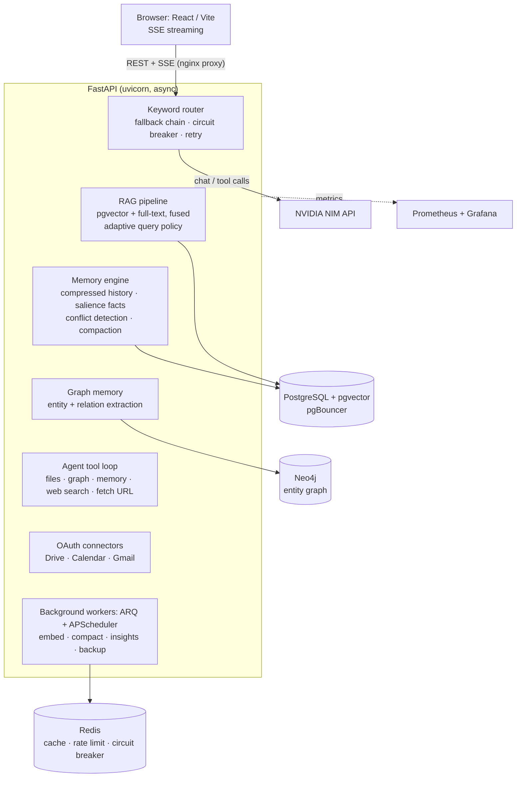

# Eidetic

[](https://github.com/ymr-gif/eidetic/actions/workflows/ci.yml)

Eidetic is a self-hosted, multi-user AI chat platform that remembers. Each user has their own
files, long-term memory and knowledge graph, and the model draws on all three when it answers.
The whole thing runs as one Docker Compose stack.

Backend: Python, FastAPI. Frontend: React, Vite. Data: PostgreSQL + pgvector, Redis, Neo4j.
Inference: NVIDIA NIM today, or any OpenAI-compatible endpoint.


*A keyword-routed streaming reply (fast role, then reasoning role), then the agent tool loop
reading an attached file. Each reply shows its model, a token and cost meter, and
retrieval-grounding badges.*

## Try it live

**[https://eidetic.work](https://eidetic.work)**, log in with:

```
username:  demo
password:  eidetic-demo
```

A read-and-chat sandbox. Registration is invite-only. Every login spins up its own **private,
auto-expiring sandbox**: your chats, files, and memory are isolated to your session and wiped
after a couple of hours idle, so don't rely on anything you save there persisting. Spend is
capped ($1 per session, pooled ceiling across all demo sessions).

Eidetic runs on a home server, so it is not a 24/7 service. If the box is down you will get a
status page telling you when it was last seen, rather than a dead link.

## What it does

- **Routing.** A keyword classifier picks a model role per message (general, coder or
  reasoning), with a fallback chain, circuit breaker, retry with jitter, and per-user and
  per-model rate limits. An admin-curated live catalog tracks which NIM models actually respond.
- **Retrieval.** Hybrid search over uploaded files: pgvector cosine similarity plus Postgres
  full-text, fused, with a per-query policy (factual, relational, temporal, broad).
- **Memory.** Compressed conversation history, salience-scored facts with time decay, conflict
  detection that the user resolves, and scheduled compaction.
- **Graph memory.** Entities and relations extracted after each reply into a per-user Neo4j graph.
- **Agent tool loop.** Native function calling over file, graph, memory, web search and
  URL-fetch tools. Memory writes and calendar writes wait for the user to confirm.
- **Operations.** Per-user spend caps, invite-gated registration, an admin audit log,
  Prometheus metrics with a Grafana dashboard, and daily database backups.

Thresholds, the full tool table and everything else: [docs/features.md](docs/features.md).

## What is not finished

- **Connectors.** Google Drive, Calendar and Gmail are built end to end (OAuth, token refresh,
  agent tools), but their connect buttons are off by default and off in the public demo.
  Notion and GitHub have OAuth and ingest code only, with no agent tools.
- **Inference backend.** NVIDIA NIM is a test backend. The app targets a self-hosted home
  server (llama.cpp/GGUF) through one OpenAI-compatible endpoint, so porting is a config
  change (`LLM_BACKEND=homeserver`), not a rewrite.
- **Optional features.** Image OCR, voice input, web search and the email digest ship switched
  off. Each has a flag in `.env.example`.

## Architecture


```mermaid
flowchart TB
    Browser["Browser: React / Vite<br/>SSE streaming"]
    Browser -->|"REST + SSE (nginx proxy)"| Router

    subgraph API["FastAPI (uvicorn, async)"]
        direction TB
        Router["Keyword router<br/>fallback chain · circuit breaker · retry"]
        RAG["RAG pipeline<br/>pgvector + full-text, fused<br/>adaptive query policy"]
        Memory["Memory engine<br/>compressed history · salience facts<br/>conflict detection · compaction"]
        GraphMem["Graph memory<br/>entity + relation extraction"]
        Tools["Agent tool loop<br/>files · graph · memory · web search · fetch URL"]
        Connectors["OAuth connectors<br/>Drive · Calendar · Gmail"]
        Background["Background workers: ARQ + APScheduler<br/>embed · compact · insights · backup"]
        Router ~~~ RAG ~~~ Memory ~~~ GraphMem ~~~ Tools ~~~ Connectors ~~~ Background
    end

    Router -->|"chat / tool calls"| NIM["NVIDIA NIM API"]
    RAG --> PG[("PostgreSQL + pgvector<br/>pgBouncer")]
    Memory --> PG
    GraphMem --> Neo[("Neo4j<br/>entity graph")]
    Background --> Redis[("Redis<br/>cache · rate limit · circuit breaker")]
    API -.->|"metrics"| Prom["Prometheus + Grafana"]
```

## Quickstart

**Prerequisites:** Docker + Docker Compose, [NVIDIA NIM API key](https://build.nvidia.com/)

```bash
git clone https://github.com/ymr-gif/eidetic.git
cd eidetic
cp .env.example .env
```

Set the minimum required values in `.env`:

```env
NVIDIA_API_KEY=nvapi-...
JWT_SECRET_KEY=change-me-to-a-random-secret
```

```bash
cd docker && docker compose up -d
```

| Service | URL |
|---|---|
| Frontend | `http://localhost:3000` |
| API docs | `http://localhost:8000/docs` |
| Grafana | `http://localhost:3001` |
| Neo4j browser | `http://localhost:7474` |

Seed the accounts with `python backend/create_user.py` (creates `admin`, `user`, `demo`). It is
idempotent and never overwrites an existing account. Each password comes from `SEED_ADMIN_PASSWORD` /
`SEED_USER_PASSWORD` / `SEED_DEMO_PASSWORD`, or is randomly generated and printed once if those are
unset. There are no default passwords to look up here.

> Note: store the generated passwords outside this repository. Registration is invite-gated when
> `REQUIRE_INVITE=true`; per-user spend caps (`cost_limit_usd`) are set at seed time.

Every variable is documented in `.env.example`. The commonly changed ones, and the current
model table, are in [docs/configuration.md](docs/configuration.md).

## Tests

```bash
cd backend
pip install -r requirements-dev.txt
pytest -m "not infra and not live_nim and not optional"   # unit tier, no services needed
pytest tests/retrieval/                                    # retrieval eval, mocked database
```

CI runs both on every pull request, plus an infra tier against real Postgres, Redis and Neo4j.
A live end-to-end tier (`RUN_LIVE_NIM=1`) runs against a running stack and a real model.

## Layout

```
backend/    FastAPI app: api/ (routes), llm/ (routing, retrieval, memory, tools),
            services/ (workers, connectors), alembic/ (migrations), tests/
frontend/   React + Vite UI
docker/     Compose files, Dockerfiles, nginx, Grafana provisioning
edge/       Cloudflare Worker in front of the public demo (offline page when the server is down)
docs/       features, API reference, configuration
```

## More

- [docs/features.md](docs/features.md): every feature in detail
- [docs/api.md](docs/api.md): endpoint overview
- [docs/configuration.md](docs/configuration.md): environment variables and models
- [ROADMAP.md](ROADMAP.md): what is planned
- [CONTRIBUTING.md](CONTRIBUTING.md): branch and pull request workflow

## License

MIT
