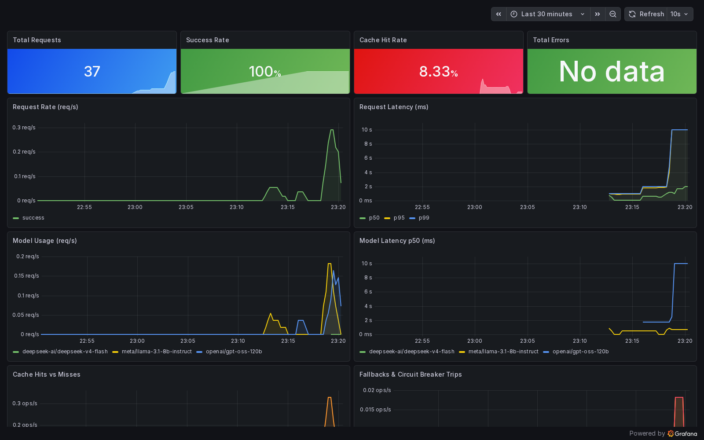

# Features

The long version of the feature list in the [README](../README.md). Thresholds and limits quoted
here are defaults; `backend/config.py` and `.env.example` are the source of truth.

## Inference & Routing
- **Keyword classifier** automatically picks the right model for the task; supports per-request override and per-conversation model lock
- **Live model catalog** (admin-curated): scheduled scanner probes available NVIDIA NIM models; admins enable/disable, set per-model pricing and request extras; users can search and pick models by name, lock conversations to them, or compare 2–4 models side-by-side
- **Fallback chain**: `chosen model → reasoning → coder → llama` — never drops a request if a model is available
- **Circuit breaker**: 5 consecutive failures trip the circuit; 90s cooldown; Redis-persisted across restarts; pre-tripped at startup if a model probe fails
- **Retry with jitter**: up to 4 attempts with exponential + jitter backoff (~1s / 2s / 4s / 8s)
- **Rate limiting**: sliding-window per user (15 req/60s) + per model (llama=15, coder=10, reasoning=5); Redis-backed; fail-open when Redis is down

## Retrieval-Augmented Generation
- **Hybrid retrieval**: pgvector cosine similarity + PostgreSQL BM25 full-text, parallelised, fused via Reciprocal Rank Fusion (k=60) or weighted fusion with configurable α
- **Adaptive query policy**: classifies each query as `factual` / `relational` / `temporal` / `broad` and selects the fusion strategy and k accordingly
- **File knowledge base**: upload PDF, DOCX, XLSX, plain text/code/markdown; streaming SHA-256 dedup; 1600-char chunks, 200-char overlap, sentence-aligned tail
- **Context budget allocator**: drops lowest-priority memory tiers when the prompt would exceed `context_window − max_output_tokens − 10%`; re-applied on every tool iteration

## Memory System
Memory is layered — injected in priority order on every turn:

```
system prompt → graph context → graph facts → user state → active goals
→ project summary → relevant chunks → earlier history → last session
→ conversation history → file context → user message
```

- **Compressed history**: summarised when conversation exceeds 4 000 tokens or 15 messages
- **Project summary**: maintained separately; updated alongside history compression
- **Salience scoring**: per-fact `0.95^(hours/24)` time decay before top-20 selection; bumped on every access; facts below 0.05 pruned
- **Memory compaction**: LLM-driven dedup and merge; snapshots to `UserMemoryVersion`; scheduled daily at 03:00 UTC via APScheduler
- **Conflict resolution**: contradicting facts detected and stored as `MemoryConflict`; user resolves via keep A / keep B / merge / discard; auto-resolved `keep_a` after 7 days
- **Preference extraction**: runs every 50 assistant messages; no LLM inference cost per turn
- **Behavior profile**: lightweight per-reply counters (query types, topics, tools, models used); feeds proactive insight generation

## Graph Memory (Neo4j)
- Entity and relationship extraction by the reasoning model after each reply
- Per-user knowledge graph with a 500-entity cap; LRU eviction by `updated_at`
- Graph query results Redis-cached (TTL 60s); cache busted on every write
- Fulltext index `entity_name_ft` + range index `entity_user_id` created on startup
- Batch UNWIND writes (2 round-trips regardless of entity/relation count)

## AI Agent Tool Loop
Tools are offered on **capability alone** (connector active, env flag on, files attached, URL present) and the model decides when to call them via native function calling. Attaching file IDs forces the reasoning model.

| Tool | Description |
|---|---|
| `list_files` | list knowledge base files |
| `read_file` | read up to 100k chars (capped to 12k in context) |
| `write_file` / `create_file` / `append_to_file` | file mutations |
| `patch_file` | fuzzy find-and-replace (exact → CRLF-norm → stripped-edges) |
| `search_in_file` / `search_across_files` | search without full reads |
| `ask_user` | pause the loop and ask the user a question; resumes on reply |
| `query_graph` | Cypher query against the user's Neo4j graph |
| `write_memory` | propose a memory write; requires user confirmation |
| `web_search` | search the web for live information; offered whenever `WEB_SEARCH_ENABLED=true` (capability gate only — the model decides when to call it); backends: SearXNG (self-hosted) or Tavily |
| `fetch_url` | fetch and read the full text of any web page mid-conversation; injected when the user's message contains a URL; ephemeral — content is returned as tool-result context, nothing stored; SSRF-hardened: scheme allowlist, DNS-pinned connection (TOCTOU-safe), port allowlist `{80, 443}`, 1 MB byte cap, Content-Type allowlist |
| `drive_list_files` / `drive_read_file` / `drive_search` | read-only Google Drive access; offered when the connector is active **and** the session has latched on Drive intent (embedding-cosine intent latch — schemas are withheld until then, so a greeting can't fire them) |
| `calendar_list_events` / `calendar_get_event` / `calendar_search_events` | read Google Calendar; active **and** calendar-intent-latched, same latch |
| `calendar_create_event` / `calendar_update_event` / `calendar_delete_event` | calendar **writes** — never hit Google from the loop; return a confirm sentinel → `confirm_calendar_write` SSE → UI confirm card → `POST /api/integrations/calendar/execute` |
| `gmail_list_messages` / `gmail_get_message` / `gmail_search_messages` | read-only Gmail access; active **and** email-intent-latched, same latch |

Tool groups: file and graph tools, `ask_user`, `write_memory`, `web_search`, `fetch_url`, and the Drive, Calendar and Gmail tools. Connector tools are injected per-user whenever that connector has an active connection. `fetch_url` is the exception — injected only when the user's message contains a URL.

Capability-available schemas are passed name-sorted for a byte-stable prompt prefix (so the KV prefix cache makes repeat cost near-zero). A `select_tool_schemas()` prefilter switch (`registry.py`) decides the final subset; below `TOOL_PREFILTER_THRESHOLD` (32) it is passthrough — all tools. An embedding prefilter path (embed the query, cosine-match against cached tool-description vectors, pass top-k) is reserved for future tool growth; at the current tool count every schema is passed through.

## OAuth Connectors
The three Google connectors (Drive, Calendar, Gmail) are implemented end to end: OAuth flow, token refresh, per-user tool injection. Notion and GitHub have the OAuth flow and an ingest path (`iter_chunks`) but no agent tools. The connect buttons are off by default: `ENABLED_CONNECTOR_TYPES` is a backend setting, empty unless set, and the UI shows every connector not listed there as "Soon". Connected sources stay active and their tools keep working regardless of the gate. Credentials are Fernet-encrypted at rest (`INTEGRATION_SECRET`); refresh-on-expiry; a 401 marks the source `needs_reauth`.

| Connector | Backend | Scope | Tools | UI Status |
|---|---|---|---|---|
| Google Drive | read-only | `drive.readonly` | `drive_list_files`, `drive_search`, `drive_read_file` | UI-gated |
| Google Calendar | read-write | `calendar.events` | list / get / search / create / update / delete | UI-gated |
| Gmail | read-only | `gmail.readonly` | `gmail_list_messages`, `gmail_get_message`, `gmail_search_messages` | UI-gated |
| Notion | read | per-provider | none | UI-gated |
| GitHub | read | per-provider | none | UI-gated |

- Drive + Calendar + Gmail share **one** Google OAuth app (`GOOGLE_CLIENT_ID/SECRET`); shared base: `GoogleOAuthConnector`.
- OAuth flow is implemented (`GET /integrations/oauth/start` → consent → callback); the UI exposes it only for connector types listed in `ENABLED_CONNECTOR_TYPES`.
- Calendar **writes never hit Google from the tool loop** — confirm sentinel flow verified live (create → confirm → execute → delete) for already-connected sources.
- A scheduler job re-syncs all active sources every 6h.

## Image OCR & Voice Input
- **Image OCR** (`IMAGE_OCR_ENABLED`, default off): CPU PaddleOCR extracts text from uploaded/pasted images and scanned PDFs (pypdfium2 render fallback, ≤20 pages); text is embedded and injected as context — no vision model required.
- **Voice input** (`VOICE_ENABLED`, default off): `POST /api/transcribe` accepts an audio upload, transcribes via the pluggable `ASR_BACKEND`, and injects the text as a chat message.

## Notifications
- Per-user preferences (`GET/PATCH /api/notifications/preferences`) gate email + web-push delivery per channel.
- Web push via VAPID: `GET /api/notifications/vapid-public-key`, `POST /api/notifications/push/subscribe` — verified end-to-end through real FCM (2026-07-03).
- Email delivery is fail-closed STARTTLS by default (`SMTP_STARTTLS=true`); a MailHog dev relay (`docker compose --profile mail up -d mailhog`, UI on `127.0.0.1:8025`) verifies delivery locally with `SMTP_STARTTLS=false`.

## Daily/Weekly Digest
An APScheduler cron job generates a per-user markdown summary of the past 7 days — new files uploaded, memory snapshots taken, insights generated, and goals updated. Delivered as a `UserInsight` (visible in the Insights panel) and optionally emailed via SMTP.

| Variable | Default | Description |
|---|---|---|
| `DIGEST_ENABLED` | `false` | Enable the digest job |
| `DIGEST_SCHEDULE` | `0 8 * * 1` | Cron schedule (default: Monday 8 AM UTC) |
| `SMTP_HOST` | — | SMTP server hostname; leave blank to skip email |
| `SMTP_PORT` | `587` | SMTP port (`465` = implicit TLS, no STARTTLS) |
| `SMTP_STARTTLS` | `true` | Require STARTTLS (fail-closed); set `false` only for plain dev relays (MailHog) |
| `SMTP_USERNAME` | — | SMTP login username |
| `SMTP_PASSWORD` | — | SMTP login password |
| `SMTP_FROM` | — | Sender address (falls back to `SMTP_USERNAME`) |

Users set their email address via `PATCH /auth/me/email`. If unset, digest is delivered as `UserInsight` only.

## Event-Driven Webhook Triggers
External systems can POST events to the platform via a per-user token:

```
POST /api/webhooks/{user_token}   { "event_type": "reminder", "payload": {...} }
```

Supported event types: `file.uploaded` · `reminder` · `external.data`

Each event is persisted as a `WebhookEvent` record, then an ARQ job generates a `UserInsight` from the payload. Users manage their token via:

```
GET    /auth/me/webhook-token   — retrieve current token (null if not yet generated)
POST   /auth/me/webhook-token   — generate / regenerate token
DELETE /auth/me/webhook-token   — revoke token
```

## Frontend
- **Panels**: Sidebar, MessageList, ModelToolbar, FilesPanel, FileViewer, ToolLogPanel, UsagePanel, InsightsPanel, InvitePanel, MemoryPanel, SearchPanel, AutomationsPanel, GoalsPanel, **IntegrationsPanel**, SettingsModal
- **Hooks**: dedicated hook per domain (`useStreamChat`, `useMemory`, `useFiles`, `useGoals`, `useIntegrations`, `useVoice`, `useNotificationPrefs`, `useOnboarding`, etc.)
- **SSE streaming**: raw cursor → done → `<ReactMarkdown>`; per-bubble token count, cost, query type, source count, grounding-confidence badge, cyan `web` badge (`web_searched`), and blue `url` badge (`url_fetched`)
- **Unified search**: fans out to files, conversations, memory, and graph; results grouped by source
- **Memory panel**: per-fact salience score bars, conflict resolution UI, interactive graph (ReactFlow circle layout with click-to-highlight)
- **Goals + Automations**: CRUD panels for user goals (with conversation linking) and scheduled prompts (cron + daily/weekly/monthly aliases)

## Observability
- **Activity trace**: every pipeline step (`cache → route → budget → model_call → fallback → tool`) timed, tagged with `level: error | info`, and persisted as JSONB on the assistant message
- **Prometheus + Grafana**: provisioned dashboard, automated alert rules (circuit breaker trip, success rate < 99%); TSDB persists across restarts via named volume


- **Prometheus multiprocess mode**: uvicorn workers share a tmpfs metric dir; `/metrics` endpoint aggregates via `MultiProcessCollector`
- **Structured logging** throughout; request ID (`X-Request-ID`) on every response

## Infrastructure
- **pgBouncer** in transaction mode: 200 max clients, 20 server connections; `AUTH_TYPE=plain` required for pg16
- **ARQ task queue**: 4 retry attempts with 5s / 30s / 120s backoff; per-job failure counter in Prometheus
- **Automated daily backup**: `pg_dump` → gzip → `storage/backups/`; configurable retention via `KEEP_DAYS`; restore rehearsed against a scratch container (2026-07-03)
- **MailHog dev relay** (`--profile mail`): loopback-only SMTP catcher for verifying digest/notification email without a provider
- **Alembic migrations**, applied automatically on container start

## Auth & Admin
- JWT (HS256) + API key fallback; API keys stored as SHA-256 hex — plaintext never persisted
- bcrypt passwords; invite-gated registration; `is_active` gate on every request
- Per-user cost cap with rolling window (402 on exceed) — enforced and **metered on every chat endpoint**, including the stateless `/chat` and `/v1/chat/completions` (spend recorded to a hidden per-user usage ledger); admin audit log for all privileged actions
- Live `.env` management via `/admin/env` — masked values, atomic write, hot reload via `importlib.reload(config)`
